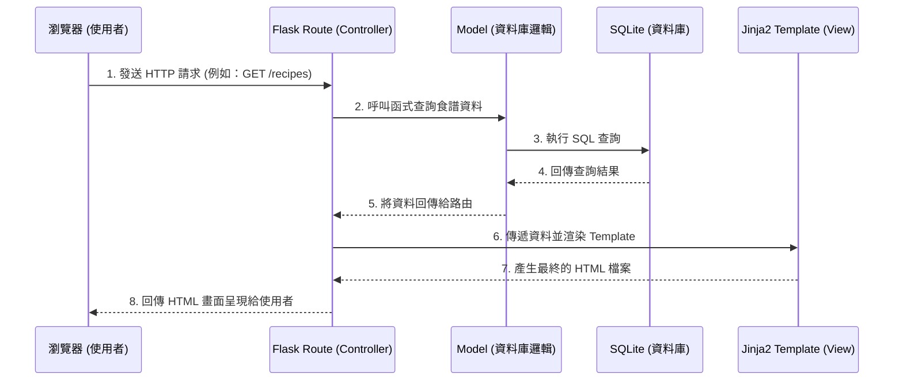

# 系統架構文件 - 食譜收藏夾系統

## 1. 技術架構說明

本系統採用經典的單體式架構（Monolithic Architecture），不進行前後端分離，透過 Flask 框架搭配 Jinja2 模板引擎進行伺服器端渲染（Server-Side Rendering, SSR）。

### 選用技術
*   **後端框架：Python + Flask**
    *   **原因**：Flask 是輕量級的 Web 框架，適合快速開發 MVP，且學習曲線平緩。對於食譜收藏夾這類以資料存取為核心的應用來說，能夠提供足夠的彈性與效能。
*   **視圖與渲染：Jinja2**
    *   **原因**：與 Flask 深度整合，能將後端資料無縫嵌入 HTML 模板中，快速生成動態網頁。
*   **資料庫：SQLite**
    *   **原因**：無須額外架設資料庫伺服器，將資料儲存在本地端檔案，適合初期專案與個人使用，部署與備份都十分方便。

### Flask MVC 模式對應
雖然 Flask 原生未強制規範 MVC，但我們將依循 MVC（Model-View-Controller）的設計精神來組織程式碼：
*   **Model (模型)**：負責定義資料結構與操作資料庫（如：Recipe, Category, Tag）。
*   **View (視圖)**：由 Jinja2 模板（`.html`）負責，呈現介面給使用者。
*   **Controller (控制器)**：由 Flask 的路由（Routes）負責，接收使用者的請求、向 Model 索取資料、最後交給 View 去渲染。

## 2. 專案資料夾結構

為了讓程式碼好維護，我們將專案結構模組化，避免把所有程式碼塞在同一個檔案。

```text
web_app_development/
│
├── app/                      # 應用程式核心資料夾
│   ├── models/               # Model (模型) - 負責資料庫操作與資料結構定義
│   │   ├── __init__.py
│   │   └── recipe.py         # 食譜與分類相關的資料庫模型
│   │
│   ├── routes/               # Controller (控制器) - 負責處理網址路由與商業邏輯
│   │   ├── __init__.py
│   │   ├── recipe_routes.py  # 食譜相關路由 (新增、編輯、檢視、搜尋)
│   │   └── category_routes.py# 分類與標籤管理路由
│   │
│   ├── templates/            # View (視圖) - Jinja2 HTML 模板
│   │   ├── base.html         # 共用版型 (包含導覽列與頁尾)
│   │   ├── index.html        # 首頁 (食譜列表與搜尋)
│   │   ├── recipe_detail.html# 食譜檢視與筆記頁面
│   │   ├── recipe_form.html  # 新增/編輯食譜表單
│   │   └── category_mgr.html # 分類管理頁面
│   │
│   └── static/               # 靜態資源檔案
│       ├── css/
│       │   └── style.css     # 自訂樣式表
│       ├── js/
│       │   └── script.js     # 前端互動腳本 (如：動態新增標籤)
│       └── images/           # 網站圖片與預設縮圖
│
├── instance/                 # 放置不進入版控的環境變數與資料庫
│   └── database.db           # SQLite 資料庫檔案
│
├── docs/                     # 專案文件
│   ├── PRD.md                # 產品需求文件
│   └── ARCHITECTURE.md       # 系統架構文件
│
├── app.py                    # 程式進入點 (負責初始化 Flask 與註冊藍圖)
├── requirements.txt          # Python 依賴套件清單
└── README.md                 # 專案說明文件
```

## 3. 元件關係圖

以下是使用者操作系統時，系統內部各元件之間的互動流程：



## 4. 關鍵設計決策

1. **採用藍圖 (Blueprints) 規劃路由**
   *   **原因**：隨著系統功能增加（食譜管理、分類管理、收藏夾），若將所有路由寫在 `app.py` 會難以維護。透過 Flask Blueprints 將路由按功能拆分到 `routes/` 目錄中，能保持主程式的簡潔。
2. **共用基礎模板 (base.html)**
   *   **原因**：利用 Jinja2 的模板繼承（``）機制，將導覽列（Navbar）、CSS/JS 引入、Footer 等共用元素統一管理。未來若要修改網站主視覺或導覽列，只需修改一處即可套用到全站。
3. **圖片與靜態資源管理策略**
   *   **原因**：食譜通常伴隨圖片。初期為求簡單與快速部署，圖片將儲存在本地的 `static/images/` 中，並在資料庫記錄檔案路徑或 URL。未來若需擴充，可抽換成雲端圖床 (如 AWS S3 或 Imgur API)。
4. **使用 SQLite 作為單一資料庫來源**
   *   **原因**：不需安裝額外的 DB Server（如 MySQL 或 PostgreSQL），降低開發與環境建置的門檻。資料庫檔案 `database.db` 統一放在 `instance/` 資料夾內，並在 `.gitignore` 中排除，避免敏感資料或測試資料外洩。
