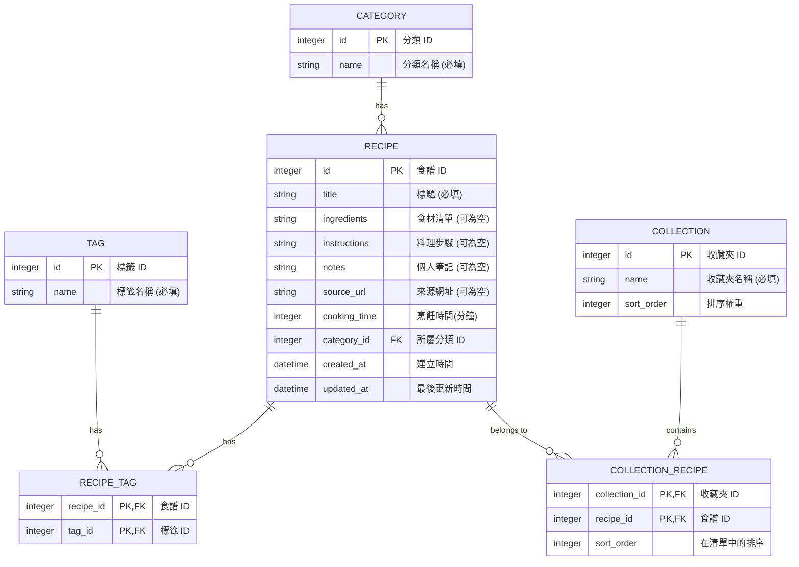

# 資料庫設計文件 - 食譜收藏夾系統

基於 PRD 的功能需求與架構設計，本文件定義了系統使用的 SQLite 資料庫 Schema、資料表關聯，並提供建表語法。

## 1. ER 圖 (實體關係圖)

以下圖表展示了系統中的主要實體與它們之間的關聯：

## 2. 資料表詳細說明

### `categories` (分類表)
負責儲存食譜的主分類（例如：主菜、甜點、湯品）。
*   `id`: INTEGER PRIMARY KEY AUTOINCREMENT
*   `name`: TEXT NOT NULL (分類名稱)

### `recipes` (食譜表)
核心資料表，負責儲存食譜的主要內容。
*   `id`: INTEGER PRIMARY KEY AUTOINCREMENT
*   `title`: TEXT NOT NULL (食譜標題)
*   `ingredients`: TEXT (食材清單，可存純文字或 JSON 字串)
*   `instructions`: TEXT (步驟說明)
*   `notes`: TEXT (個人心得筆記)
*   `source_url`: TEXT (如果是網址匯入的食譜，則記錄來源網址)
*   `cooking_time`: INTEGER (烹飪時間，單位為分鐘)
*   `category_id`: INTEGER (外鍵，對應 categories.id)
*   `created_at`: TEXT DEFAULT CURRENT_TIMESTAMP
*   `updated_at`: TEXT DEFAULT CURRENT_TIMESTAMP

### `tags` (標籤表)
負責儲存食譜的多標籤（例如：中式、低脂、快手菜）。
*   `id`: INTEGER PRIMARY KEY AUTOINCREMENT
*   `name`: TEXT NOT NULL (標籤名稱，需唯一)

### `recipe_tags` (食譜與標籤關聯表)
實現多對多（Many-to-Many）關聯。
*   `recipe_id`: INTEGER (外鍵，對應 recipes.id)
*   `tag_id`: INTEGER (外鍵，對應 tags.id)

### `collections` (收藏夾表)
負責儲存使用者的自訂清單（例如：本週菜單、節慶料理）。
*   `id`: INTEGER PRIMARY KEY AUTOINCREMENT
*   `name`: TEXT NOT NULL (收藏夾名稱)
*   `sort_order`: INTEGER DEFAULT 0 (用於調整收藏夾的顯示順序)

### `collection_recipes` (收藏夾內容關聯表)
實現收藏夾與食譜之間的多對多關聯，並記錄食譜在清單中的排序。
*   `collection_id`: INTEGER (外鍵)
*   `recipe_id`: INTEGER (外鍵)
*   `sort_order`: INTEGER DEFAULT 0 (食譜在此收藏夾中的排序順序)

## 3. SQL 建表語法

完整的建表 SQL 語法已經產出至 `database/schema.sql` 檔案中。

## 4. Python Model 程式碼

我們選用原生的 `sqlite3` 模組來實作資料庫存取，以保持輕量化。Model 檔案已產出於 `app/models/` 目錄下，包含基本的 CRUD 方法。
