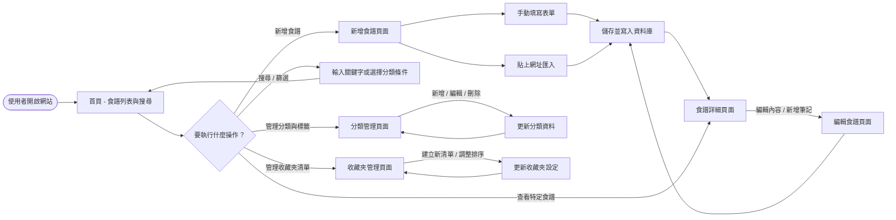
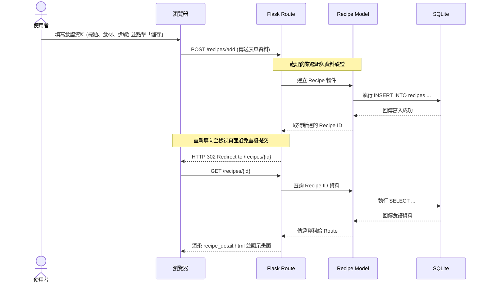

# 流程圖與路由對照文件 - 食譜收藏夾系統

這份文件基於 PRD 與系統架構設計，將使用者的操作路徑與系統內部的資料流動視覺化，並列出開發所需的路由與功能對照表。

## 1. 使用者流程圖 (User Flow)

這張圖展示了使用者進入網站後，可以進行的各種操作路徑，包含新增、檢視、編輯、搜尋與管理。

## 2. 系統序列圖 (Sequence Diagram)

這張圖以「使用者新增一篇食譜」為例，展示了從瀏覽器送出表單，到後端 Flask 處理、寫入 SQLite 資料庫並最終回傳頁面的完整生命週期。

## 3. 功能清單與路由對照表

以下是實作時需要建立的 Flask 路由（Controller）與對應功能的清單，這將作為後續開發與實作的參考基準。

### 食譜相關 (Recipe Routes)

| 功能名稱 | 對應 URL 路徑 | HTTP 方法 | 說明 |
| --- | --- | --- | --- |
| 首頁 / 食譜列表 | `/` 或 `/recipes` | GET | 顯示所有食譜，支援傳遞關鍵字與分類作篩選條件 |
| 檢視食譜詳細 | `/recipes/<int:id>` | GET | 顯示單一食譜完整內容與個人筆記 |
| 顯示新增表單 | `/recipes/add` | GET | 顯示新增食譜（支援手動與匯入）的網頁表單 |
| 送出新增食譜 | `/recipes/add` | POST | 接收表單資料，寫入資料庫並導向詳細頁面 |
| 顯示編輯表單 | `/recipes/<int:id>/edit` | GET | 顯示編輯食譜內容與筆記的表單 |
| 送出編輯食譜 | `/recipes/<int:id>/edit` | POST | 更新指定的食譜資料至資料庫 |
| 刪除食譜 | `/recipes/<int:id>/delete`| POST | 從資料庫中刪除該食譜 |

### 分類與標籤 (Category & Tag Routes)

| 功能名稱 | 對應 URL 路徑 | HTTP 方法 | 說明 |
| --- | --- | --- | --- |
| 分類管理頁面 | `/categories` | GET | 列出系統中所有的分類與標籤 |
| 新增分類 | `/categories/add` | POST | 建立一個新的自訂分類 |
| 刪除分類 | `/categories/<int:id>/delete`| POST | 刪除指定的分類 |

### 收藏夾管理 (Collection Routes)

| 功能名稱 | 對應 URL 路徑 | HTTP 方法 | 說明 |
| --- | --- | --- | --- |
| 收藏夾列表頁面 | `/collections` | GET | 顯示使用者建立的所有收藏夾清單 |
| 新增收藏夾 | `/collections/add` | POST | 建立一個新的收藏夾（如：本週菜單） |
| 調整收藏夾排序 | `/collections/<int:id>/sort` | POST | 接收拖曳排序等操作結果更新順序 |
